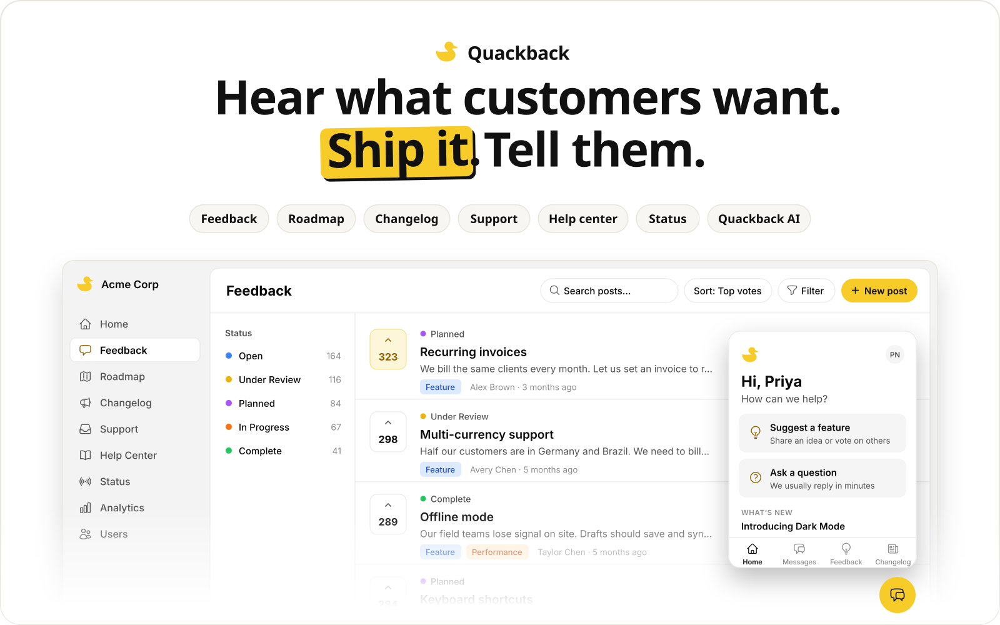

<p align="center">
  <a href="https://quackback.io">
    <picture>
      <source media="(prefers-color-scheme: dark)" srcset=".github/readme/hero-dark.svg" />
      
    </picture>
  </a>
</p>

<p align="center">
  <strong>Open-source customer feedback and support.</strong><br />
  Feedback boards, a public roadmap and changelog, a support inbox, a help center, a status page and Quackback AI, in one product you can host yourself.
</p>

<p align="center">
  <a href="https://quackback.io">Website</a> &middot;
  <a href="https://feedback.quackback.io/hc">Docs</a> &middot;
  <a href="https://feedback.quackback.io">Our live board</a> &middot;
  <a href="https://app.quackback.io/signup?plan=free">Start free</a> &middot;
  <a href="#self-host">Self-host</a>
</p>

<p align="center">
  <a href="https://github.com/QuackbackIO/quackback"></a>
  <a href="https://github.com/QuackbackIO/quackback/blob/main/LICENSE"></a>
  <a href="https://github.com/QuackbackIO/quackback/actions/workflows/ci.yml"></a>
  <a href="https://github.com/QuackbackIO/quackback/releases"></a>
</p>

## Why Quackback

- **One loop, from request to release.** Customers post and vote, you plan on a public roadmap, and when it ships, everyone who asked hears about it.
- **Support that knows what customers asked for.** Live chat, email and tickets share an inbox with your feedback, so a conversation can become a vote on a request.
- **Yours to run.** AGPL-licensed, with every feature when you self-host. Quackback Cloud runs the same code.
- **Ready for AI.** An agent answers customers, Copilot works beside your team, and an MCP server lets your own AI tools work on feedback and tickets.

## What's inside

| Product             | What it does                                                                                                                                                                                                                                                                                                                      |
| ------------------- | --------------------------------------------------------------------------------------------------------------------------------------------------------------------------------------------------------------------------------------------------------------------------------------------------------------------------------- |
| **Feedback boards** | Customers post ideas, vote and comment. Similar ideas appear as they type, and duplicates merge with their votes. Statuses, tags, segments, moderation and private boards.                                                                                                                                                        |
| **Roadmap**         | Show what's planned, in progress and complete. Link requests to Linear, GitHub, Jira and other trackers. Linear and GitHub move the request as the issue moves; other trackers send each change for your approval.                                                                                                                |
| **Changelog**       | Publish updates and link the requests they ship, so every voter hears about it. Schedule entries, and reach subscribers by email and RSS.                                                                                                                                                                                         |
| **Support inbox**   | Live chat, email and tickets in one shared inbox, with assignment, snoozing, macros, SLAs, office hours and workflows.                                                                                                                                                                                                            |
| **Help center**     | A searchable knowledge base on your own domain and inside the widget.                                                                                                                                                                                                                                                             |
| **Status page**     | Components, incidents and maintenance windows, with email updates for subscribers.                                                                                                                                                                                                                                                |
| **Widget**          | One embeddable widget for feedback, chat, help articles and your changelog. Works on the web, with SDKs for [iOS](https://github.com/QuackbackIO/quackback-ios) and [Android](https://github.com/QuackbackIO/quackback-android).                                                                                                  |
| **Quackback AI**    | An agent that answers customers from your help center, changelog and status page, and hands off to your team when a person should step in. Copilot answers your team's questions and drafts replies; on Home (in Labs) it can propose settings changes you review and apply. Also duplicate detection, summaries and translation. |
| **Developers**      | A REST API with an OpenAPI spec, signed webhooks, and an [MCP server](#connect-your-ai-tools) for AI agents.                                                                                                                                                                                                                      |

The portal and widget speak 10+ languages, including right-to-left, and follow each visitor's browser language.

## Get started

### Quackback Cloud

[Start free](https://app.quackback.io/signup?plan=free). We host, scale, back up and update it for you. The Free plan needs no card, and every paid plan starts with a 14-day trial. See [pricing](https://quackback.io/pricing).

### Self-host

Every feature, unlimited seats, no license key. You run the servers, backups and upgrades, and bring your own email and AI providers.

[](https://railway.com/deploy/quackback?referralCode=ez8Slg&utm_source=github&utm_medium=readme&utm_campaign=deploy-button)

Or run the published image with Docker Compose. It starts Quackback, PostgreSQL and S3-compatible file storage on one host:

```bash
git clone https://github.com/QuackbackIO/quackback.git
cd quackback
cp .env.prod.example .env   # fill in every value
docker compose -f docker-compose.prod.yml up -d
```

Migrations run on startup. To upgrade, back up your database and files, then:

```bash
git pull
docker compose -f docker-compose.prod.yml pull
docker compose -f docker-compose.prod.yml up -d
```

- [Self-hosting guide](deploy/self-hosted/README.md): images, reverse proxy, scaling, upgrades and troubleshooting
- [Configuration reference](docs/configuration.md): every environment variable
- [System requirements](https://feedback.quackback.io/hc/en/articles/66-requirements) and the [Docker guide](https://feedback.quackback.io/hc/en/articles/67-docker) in our docs

Self-hosted installs send one anonymous usage snapshot a day: version, setup and banded counts, never content or anything identifying. [telemetry.md](docs/telemetry.md) lists every field, and `DISABLE_TELEMETRY=true` turns it off.

## Connect your AI tools

Every instance serves an MCP server at `/api/mcp`, so agents like Claude and Cursor can search, triage and act on feedback, tickets, the changelog and help articles. Sign in with OAuth from your client:

```bash
claude mcp add --transport http quackback https://feedback.yourcompany.com/api/mcp
```

Setup for other clients is in the [MCP docs](https://feedback.quackback.io/hc/en/articles/74-mcp-server).

## Integrations

| Kind            | Tools                                                                                            |
| --------------- | ------------------------------------------------------------------------------------------------ |
| Issue trackers  | Linear, GitHub, GitLab, Jira, Azure DevOps, Asana, ClickUp, Shortcut, Trello, Monday.com, Notion |
| Chat and alerts | Slack, Microsoft Teams, Discord, ntfy                                                            |
| Support and CRM | Zendesk, Intercom, Freshdesk, HubSpot, Salesforce, Stripe                                        |
| Automation      | Zapier, Make, n8n, Segment, webhooks                                                             |

Each has a setup guide in the [docs](https://feedback.quackback.io/hc/en/collections/11-integrations).

## The cloud code in this repo

Quackback Cloud runs this codebase, so its client side lives here: a default-off `cloud` settings block, plan and entitlement checks, and a control-plane client. On a self-hosted install none of it activates. An install with no cloud configuration is entitled to every feature, shows no upgrade prompts and makes no requests to our control plane. There's nothing to opt out of. We say so here so you never have to discover it in the code.

## Contributing

Start with the [Contributing Guide](CONTRIBUTING.md), ask questions in [Discussions](https://github.com/QuackbackIO/quackback/discussions), and see what's being asked for on [our own board](https://feedback.quackback.io).

### Local development

You need [Bun](https://bun.sh/) 1.4 or later and [Docker](https://www.docker.com/).

```bash
git clone https://github.com/QuackbackIO/quackback.git
cd quackback
bun run setup    # install dependencies, start Postgres, file storage and Mailpit, run migrations
bun run db:seed  # optional: demo data
bun run dev      # http://localhost:3000
```

With the demo data, sign in as `demo@example.com` with the password `password`.

### Built with

[TanStack Start](https://tanstack.com/start) and [TanStack Router](https://tanstack.com/router), [PostgreSQL](https://www.postgresql.org/) with [Drizzle ORM](https://orm.drizzle.team/) (also the background job queue), [Better Auth](https://www.better-auth.com/), [Tailwind CSS](https://tailwindcss.com/) with [shadcn/ui](https://ui.shadcn.com/), and [Bun](https://bun.sh/).

<a href="https://github.com/QuackbackIO/quackback/graphs/contributors">
  
</a>

## License

[AGPL-3.0](LICENSE). Self-hosting is free and complete. If you run a modified version as a service or distribute it, publish your changes under the AGPL. Contributions need a signed [CLA](CLA.md).
